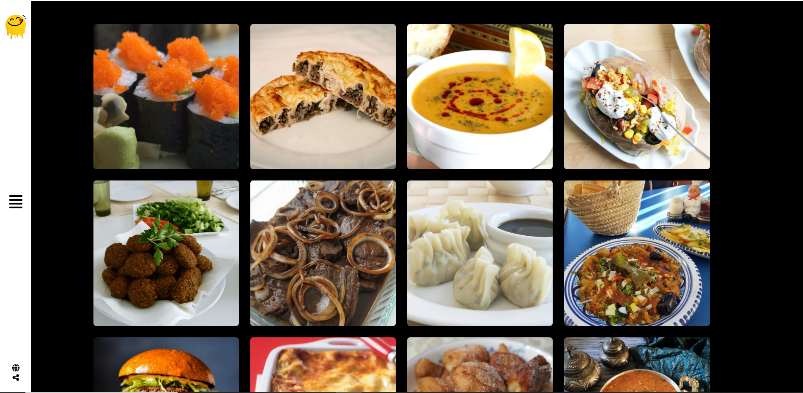
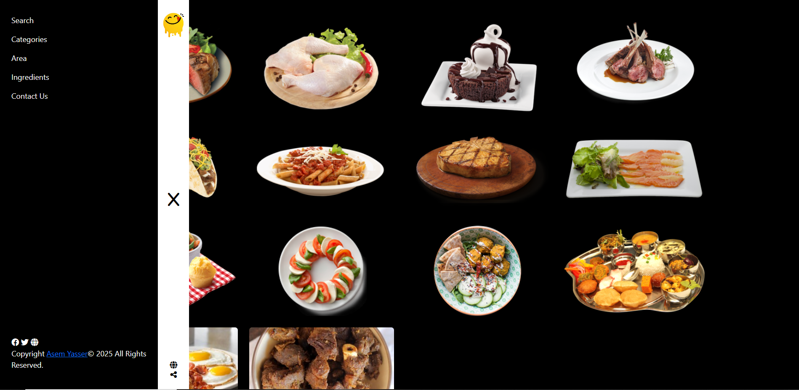
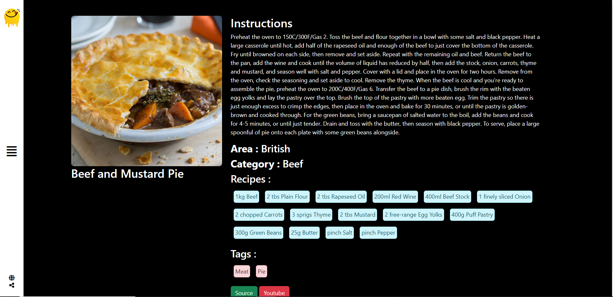

# Yummy - Recipe Finder 🍴

Yummy is a recipe finder web application that allows users to search and explore various recipes fetched from an API. Users can view detailed ingredients, preparation steps, and images for each dish.

---

## Demo

You can check out the live demo of the project here:  
👉 [Live Demo](https://asemyasser.github.io/Yummy/)

---

## Features

- **Dynamic Recipe Fetching**: Fetch recipes dynamically using an API.
- **Search Functionality**: Search recipes by name or category.
- **Recipe Details**: Display recipe details, including ingredients and instructions.
- **Responsive Design**: Optimized for both mobile and desktop devices.

---

## Technologies Used

- **Frontend**: HTML, CSS, JavaScript
- **Styling**: Bootstrap
- **API Integration**: Fetch API for retrieving recipes
- **DOM Manipulation**: Dynamic content rendering
- **CRUD Operations**: Basic CRUD functionality for managing recipes

---

## Installation

Since this is a custom HTML, CSS, and JavaScript project, you can simply clone the repository and open the `index.html` file in your browser.

1. Clone the repository:
   ```bash
   git clone https://github.com/Asemyasser/Yummy.git
   ```

2. Navigate to the project directory:
   ```bash
   cd Yummy
   ```

3. Open the index.html file in your browser:
   ```bash
   open index.html
   ```
---

## Screenshots

### Home Page


### Recipes by Category


### Details of the Recipe


---

## Acknowledgments

- **Route Academy**: For providing inspiration and resources for this project.
